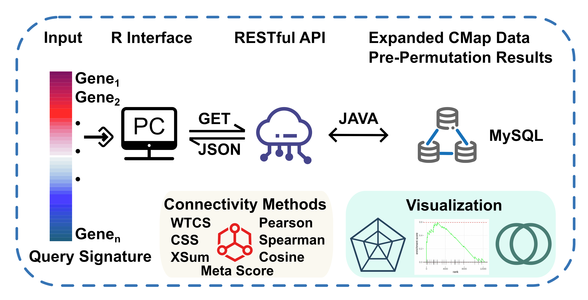
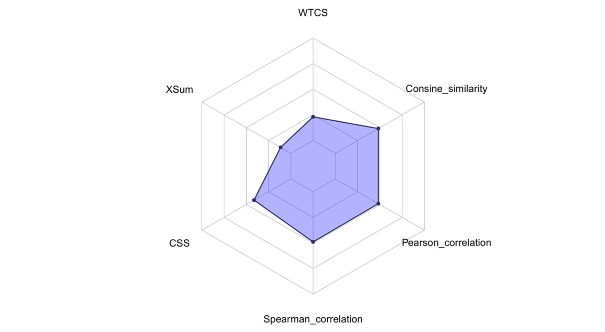
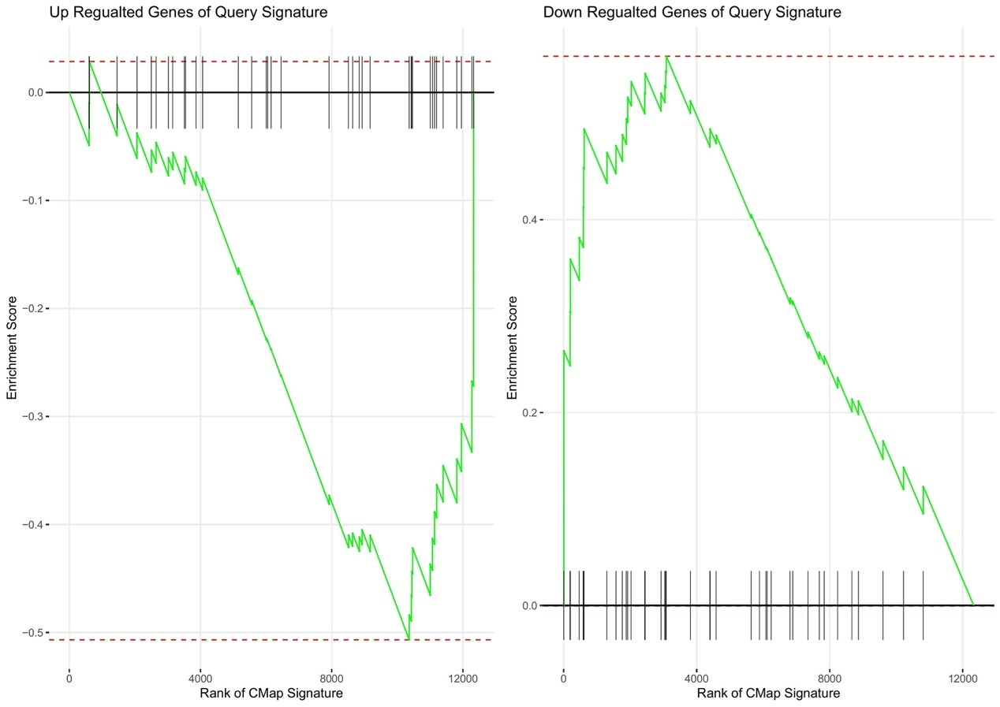
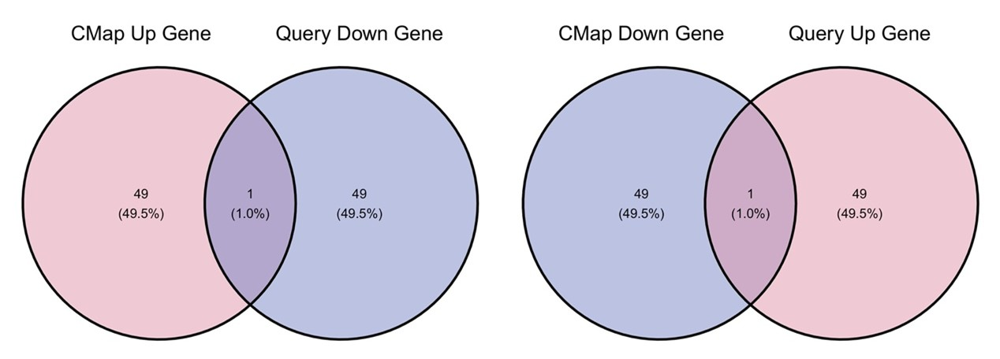

# WebCMap

WebCMap is a highly efficient platform designed for query extended CMap,
renowned for its ultra-fast computation speed and minimal resource
consumption. It aims to provide users with a convenient and reliable
solution for connectivity mapping analysis. Its main features and
objectives include:

1.  Blazing-Fast Computation: Leveraging advanced algorithm optimization
    and an efficient web-accelerated CMap architecture, WebCMap achieves
    fast in connectivity mapping large-scale signature data,
    significantly enhancing research efficiency and saving users’ time.

2.  Low Resource Requirements: The platform is designed with a focus on
    optimizing computational resources, ensuring smooth operation even
    on standard hardware configurations, thereby lowering user barriers
    and hardware costs.

3.  Accurate Connectivity Analysis: Users can input query signature and
    efficiently mapping them with extended CMap. Six kinds of
    connectivity methods and another meta score are computed to
    accurately identify candidate signatures that are positively or
    negatively correlated with the query signature.

4.  Diverse Application Scenarios: The platform is suitable for various
    fields, including drug repurposing, disease mechanism research, and
    biomarker discovery, helping researchers quickly screen potential
    drug candidates and similar drug/toxic/compound searching.

## Installation
Before install WebCMap, you should install dependencies:

``` R
if (!require("BiocManager", quietly = TRUE))
    install.packages("BiocManager")
BiocManager::install(c("AnnotationDbi","org.Hs.eg.db","fgsea"))
```
You can install the WebCMap like so:

``` R
devtools::install_github("geneprophet/WebCMap")
```

or download the source package

``` R
install.packages("/path/to/WebCMap_0.1.0.tar.gz", repos = NULL, type = "source")
```

## Example

This is a basic example demonstrating how to screen candidate drugs for
Bipolar disorder using WebCMap:

``` R
# load WebCMap
library(WebCMap)
# load the example query_signature, which is derived from TWAS analysis of Bipolar disorder (PMID:34002096)
data(query_signature)

head(query_signature)

# run the negative connectivity analysis
res = run_negative_CMap(query_signature = query_signature,K=50,cores=10)

head(res)

```

Visualization of Bipolar disorder - SC-12267 pair:

``` r
#filter the Bipolar disorder - SC-12267 pair:
data = res[res$cmap_name=="SC-12267",]
```

Radar plot:  

```R
radar_plot(data)
```




GSEA plot: 

```R
gsea_plot(data=data,query_signature=query_signature, K = 50)
```

 Venn plot: 

```R
venn_plot(data=data,query_signature=query_signature, K = 50)
```

 
